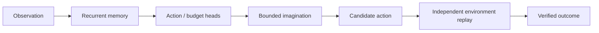

<div align="center">

# 🧠 Latent Brain

### Learn. Simulate. Verify.

**Open-source, CPU-first experiments in learned state, recurrent memory, action selection, and bounded imagination.**

[](https://github.com/Hookfabrik-AI/Latent-Brain/actions/workflows/tests.yml)


**[Explore the project site](https://hookfabrik-ai.github.io/Latent-Brain/)** · **[Run locally](#quick-start)** · **[Read the research](docs/FLYBRAIN.md)** · **[API reference](docs/API.md)**

</div>

---

> **Research prototype v0.4.** Not AGI, general-purpose reasoning, or a demonstrated enhancement to any LLM. All benchmarks are on small toy maze environments.

## Why it exists

Can a tiny neural system learn from real state transitions and verified demonstrations, remember an episode's history, imagine short futures, and choose actions more effectively than simple heuristics? **Latent Brain** provides reproducible experiments to investigate this question rather than assuming an answer.

## What is implemented

| Component | What it actually does |
|:--|:--|
| Recurrent memory | A GRU maintains hidden state *within* an episode. |
| Action preference | A trained policy head proposes one of four maze actions. |
| Bounded imagination | A learned hidden-state predictor and bounded rollouts evaluate candidate moves. |
| Thinking budget | A budget head chooses between 1, 2 or 4 simulated steps, currently trained from heuristic proxy labels. |
| World model | Separate learned transition predictor estimates whether a movement can succeed. |
| External evidence | Independent maze replay judges whether a candidate plan truly worked. |
| Local API | CPU-only HTTP inference on loopback; it does not execute or verify proposed actions. |
| Verified reward experiment (v0.4) | Separate tiny GRU policy trained by verified **synthetic** debug outcomes. No coding agent integration. |

### Architecture



## Held-out results

**Three training seeds, 30 held-out 7×7 mazes each:**

| Method | Solved / 90 |
|:--|--:|
| FlyBrain with adaptive depth | **77** |
| Same FlyBrain with fixed depth 1 | **74** |
| A* with learned transition model | **90** |

The adaptive method **did not consistently outperform** its fixed-depth counterpart across the three seeds. A* was better on this toy experiment. These findings do **not** establish general reasoning capabilities. See [design, protocols and the seed-by-seed results](docs/FLYBRAIN.md).

## v0.4 · Verified Cookie Reward Learning (toy lab)

A separate research track combines recurrent memory, bounded imagined action paths,
a learned compute budget, and **one-time verifier-issued reward receipts**.
The policy is updated from measured toy-environment outcomes, *not* from
self-declared PASS or expert action labels. An external-agent adapter only
**suggests** actions; it cannot execute them or grant cookies.

Three training seeds (250 training episodes each), 80 unseen synthetic cases per seed:

| Policy | Solved / 240 |
|:--|--:|
| Randomly initialized neural policy (weak baseline) | **0** |
| Reward-trained neural policy | **240** |
| Same policy forced to depth 1 | **240** |
| Handwritten inspect → test → report rule | **240** |

**Interpretation:** the policy learned this tiny debugging workflow, but a
three-line non-neural rule also solves it perfectly. **No advantage of learned
adaptive thinking has been demonstrated**; this is not a real code-repair
benchmark. No private source code or execution traces are included.
Read the [reward protocol and integration boundary](docs/COOKIE_REWARDS.md),
and inspect the [multi-seed report](reports/cookie_reward_evaluation_v0.4.json).

## Quick start

Python 3.10+ and PyTorch are required. CPU training/inference are supported.

```bash
git clone https://github.com/Hookfabrik-AI/Latent-Brain.git
cd Latent-Brain
python -m venv .venv
source .venv/bin/activate
python -m pip install -e '.[test]'
python -m pytest -q
```

Run the bundled FlyBrain sample without retraining:

```bash
python -m latent_brain demo-fly \
  --fly-checkpoint examples/pretrained_fly_v0.3.pt \
  --checkpoint examples/pretrained_v0.1.pt
```

Train and evaluate independently:

```bash
python -m latent_brain train-fly --fly-checkpoint checkpoints/fly.pt
python -m latent_brain evaluate-fly \
  --fly-checkpoint checkpoints/fly.pt \
  --checkpoint examples/pretrained_v0.1.pt
```

Run the separate, verified reward experiment:

```bash
python -m latent_brain train-cookie --seed 42 --episodes 250 \
  --hidden-size 32 --reward-checkpoint checkpoints/reward.pt
python -m latent_brain evaluate-cookie --reward-checkpoint checkpoints/reward.pt
```

## Local inference API

Start the HTTP API (loopback only):

```bash
python -m latent_brain serve \
  --checkpoint examples/pretrained_v0.1.pt \
  --fly-checkpoint examples/pretrained_fly_v0.3.pt \
  --port 8767
```

```bash
curl http://127.0.0.1:8767/v1/health
```

Endpoints: `GET /v1/health`, `POST /v1/predict`, `POST /v1/plan`, `POST /v1/fly/decide`. **Returned plans are hypotheses, not verified results.** More examples: [API reference](docs/API.md).

## Research boundaries

- The maze policy uses *verified expert demonstrations*. The separate v0.4 toy debugging policy learns from environment rewards; neither establishes coding skill.
- The thinking-budget labels are heuristic proxies, not measured optimal compute allocations.
- The one-step learned hidden-state model is not a general long-horizon world model.
- No coding LLM integration or demonstrated lift on real coding benchmarks exists yet.
- Published test reports and checkpoints support reproduction; results on other tasks must be established separately.

## Documentation

[FlyBrain design](docs/FLYBRAIN.md) · [Verified rewards](docs/COOKIE_REWARDS.md) · [Experiments](docs/EXPERIMENTS.md) · [Results](docs/RESULTS.md) · [API](docs/API.md) · [Contributing](CONTRIBUTING.md) · [Security](SECURITY.md)

Contributions are welcome, especially new held-out environments, calibrated baselines, adversarial evaluation, and meaningful ablations.

## License

Apache License 2.0. See [LICENSE](LICENSE).
